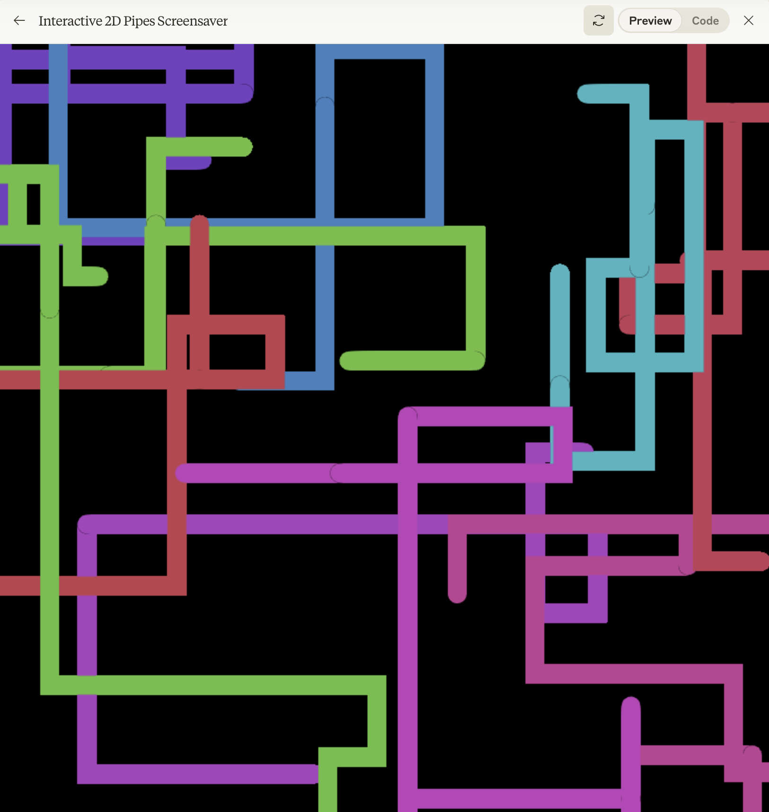
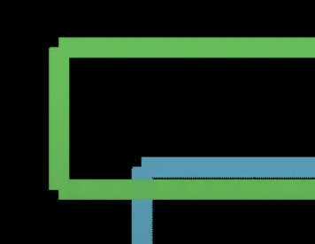
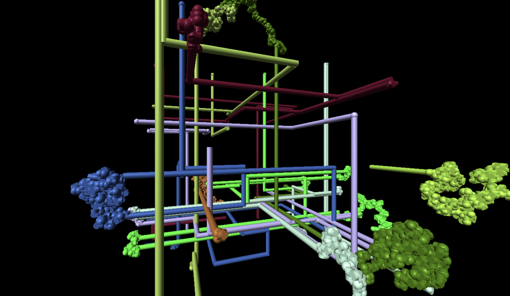

# Pipes Screensaver, written entirely by Claude
A re-creation of the classic Windows 3D "Pipes" screensaver, written entirely by Claude 3.5 Sonnet, (over many iterations)!

View the [live page here](https://eschluntz.github.io/pipe-screensaver.html)

## Start simple and iterate

My main approach when coding with LLMs is to start with as detailed a spec as possible, often created in part with the LLM.

```
I want to re-create the classic Windows screensaver of pipes growing across the screen in javascript. Before restart coding I want to create a clear spec.

- The background is black
- 10 Pipes start in random locations, each with a random matt color. each pipe stays the same color permanently.
- Each pipe quickly grows in one of the cardinal directions, and randomly changes directions every so often.
- There is a minimum distance that pipes must go before changing directions, roughly 5x pipe diameter.
- Pipes cannot turn 180° and move back in on themselves
- 75% of the time when a pipe turns there is a smooth elbow connection. 25% of the time a ball joint appears.
- Let's start with a 2-D version and make sure that it looks good!
```

Claude then wrote a detailed spec document that was _mostly_ correct,and I tweaked a few things.

```
Updates to your spec:
* Change minimum straight distance to two times diameter
* No need to do collision detection, it's OK for pipes to cross each other
* If a pipe reaches the edge of the canvas it should turn. If it is a along the edge of the canvas it cannot turn into it
* Elbow radius should be one times the pipe diameter, so the inside of the turn is a hard right angle
```

Just like with humans, it's faster and easier to iterate on the spec than code. I got a pretty good initial 2D version:



I iterated a bit in 2D to get details like balljoints vs elbow joints correct.

Claude will certainly make mistakes, but it's also often quite fast to resolve them:



```
you fixed the bug, but now the joints just look like rectangles
```

I'd say that Claude can fix it's own bugs 2/3 the time. If I try twice and Claude still can't get it, that's when I begrudgingly go look at the code myself.

## Import Magic

```
Looks great! Let's make it 3-D
```

This is the real magic of LLMs for me - in a single command and about 10s Claude completely transformed the code from simply drawing on a canvas to using `Three.js`! This would have taken me a few hours!



Now of course there are some new bugs that I had to debug with claude. In particular, getting the curves and ball joints (especially at the boundary edges) just right took many iterations.

View the [live page here](https://eschluntz.github.io/pipe-screensaver.html)

Overall, this felt like the future of what programming will be: 
- Much less writing code
- Much more product managing the LLM to get what you want 
- Still requires understanding and reading code
